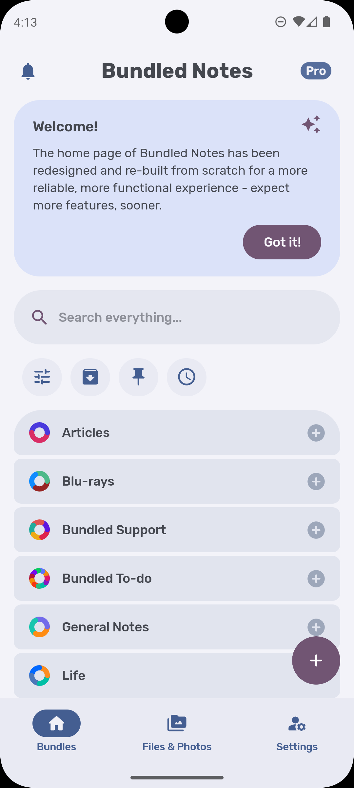
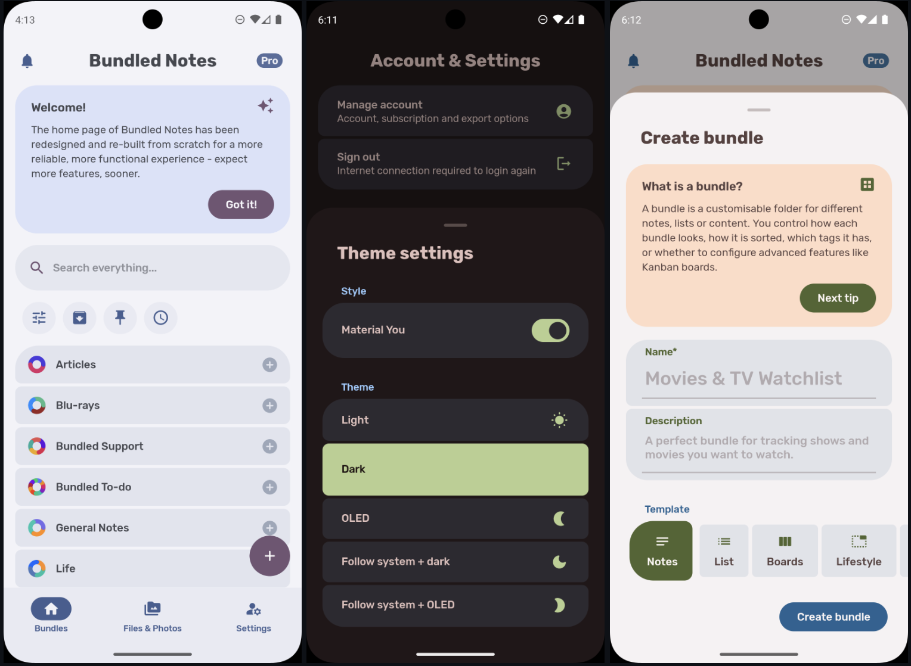
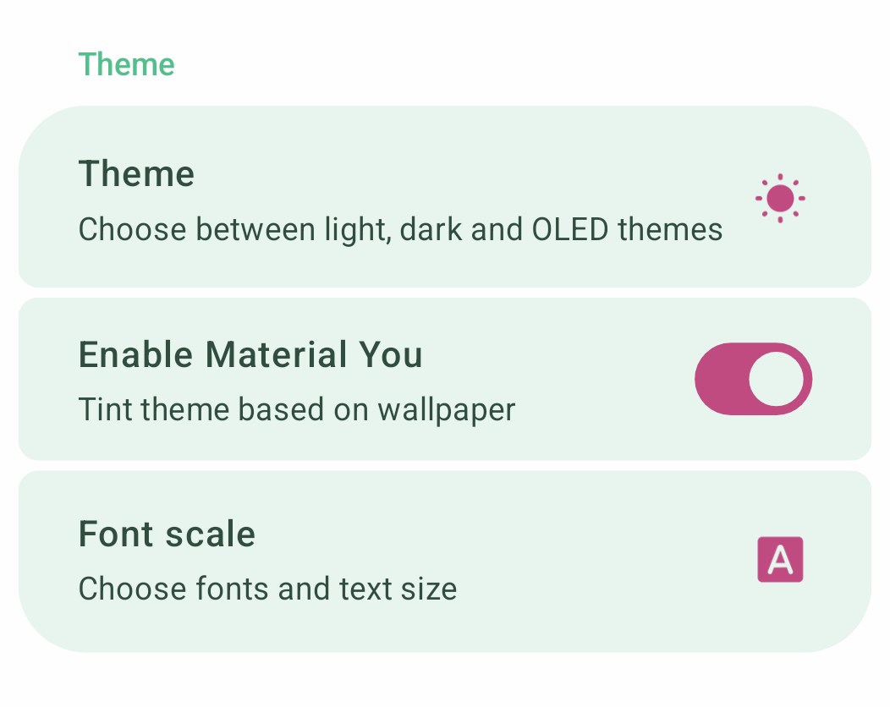

> IN PROGRESS

# Bundled UI for Jetpack Compose

A radically simple, idiomatic Material 3 UI design system for Jetpack Compose,
built for
[Bundled Notes](https://play.google.com/store/apps/details?id=com.xaviertobin.noted).

## Quick look

<!--  -->



## What's included?

BundledUI is the design system used in Bundled Notes. It includes a whole suite
of components and utilities that were required to build the app. In summary:

#### `Section`

`Section` is the building block component that is found on almost every page of
BundledUI (and accordingly, Bundled Notes). It is essentially a card that
abstracts away all fiddling with padding, margin, and modifiers.

`Section` is built with DRY (don't repeat yourself) principles in mind. Once you
know how to use one `Section`, you know how to use the entire suite of Section
widgets included in the library, and it becomes trivial to build layouts.

All you have to do to get started is group related `Sections`, and set their
`first` and `last` params:

```kotlin
Column {

  SectionHeader("Theme")

  SectionSwitch(
      first = true,
      text = "Enable Material You",
      description = "Tint the theme ",
      checked = isChecked,
      onChecked = { isChecked = it }
  )

  SectionButton(
      text = R.string.theme,
      description = R.string.change_theme_settings,
      icon = Icons.Rounded.WbSunny,
      onClick = { /* toggle between themes*/ }
  )

  SectionButtonSheet(
      title = "Font options",
      description = "Choose fonts and text size",
      icon = Icons.Rounded.FontDownload,
      last = true,
  ) { onDismiss ->
      FontSettingsSheet(onDismiss = onDismiss)
  }

}
```

The above code leads to this layout:



> [!INFO]
> Note that you don't have to think about padding and margins at all
> when using sections. The `first` and `last` parameters take care of all that
> for you - you could easily build a settings page, for example, by laying out a
> few groups of Sections.

### Benefits

- Lightweight abstraction, minimal dependencies
- Easy to use, hard to mis-use
- Almost no padding or margin management required

## Section

A Section is the building block of almost all organisms in Bundled UI. It is a
simple card with the following features:

To build your UI, all you need to do is group related `Section`s, and correctly
set the first and last parameters.

# Why ?

Material3 is a powerful suite of components for building beautiful Compose UIs,
but many of the interactive widgets are
[atom-level](http://atomicdesign.bradfrost.com/chapter-2/) components that
require wrapping and regular management of padding, margin and modifiers in
order to create a consistent, beautiful UI.

BundledUI is intended to be an out-of-the-box solution for building beautiful,
consistent Material3 UIs. It is intentionally opinionated - designed to be
extendable, easy to use, and hard to mis-use.
